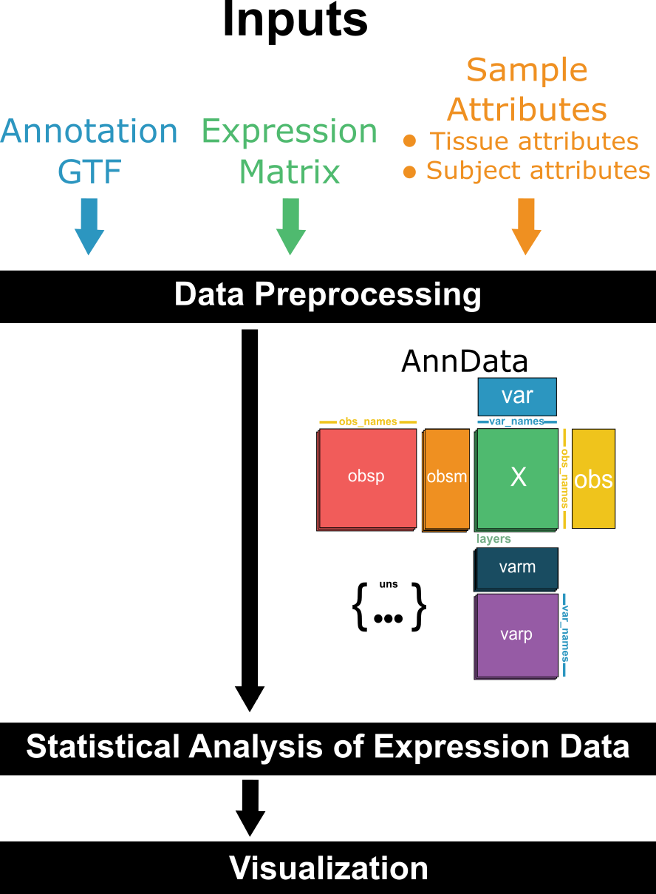

<h1>
  <picture>
    <source media="(prefers-color-scheme: dark)" srcset="docs/images/nf-core-genomicvista_logo_dark.png">
    
  </picture>
</h1>

[](https://github.com/nf-core/genomicvista/actions/workflows/nf-test.yml)
[](https://github.com/nf-core/genomicvista/actions/workflows/linting.yml)[](https://nf-co.re/genomicvista/results)[](https://doi.org/10.5281/zenodo.XXXXXXX)
[](https://www.nf-test.com)

[](https://www.nextflow.io/)
[](https://github.com/nf-core/tools/releases/tag/3.3.2)
[](https://docs.conda.io/en/latest/)
[](https://www.docker.com/)
[](https://sylabs.io/docs/)
[](https://cloud.seqera.io/launch?pipeline=https://github.com/nf-core/genomicvista)

[](https://nfcore.slack.com/channels/genomicvista)[](https://bsky.app/profile/nf-co.re)[](https://mstdn.science/@nf_core)[](https://www.youtube.com/c/nf-core)

## Introduction


<!-- TODO nf-core:
   Complete this sentence with a 2-3 sentence summary of what types of data the pipeline ingests, a brief overview of the
   major pipeline sections and the types of output it produces. You're giving an overview to someone new
   to nf-core here, in 15-20 seconds. For an example, see https://github.com/nf-core/rnaseq/blob/master/README.md#introduction
-->

**nf-core/genomicvista** is a bioinformatics pipeline that processes raw GTEx expression data into a structured analytical object for demographic-stratified target discovery through integration of metadata (sex and age). It takes a samplesheet as input with urls or files paths to the following:


* Annotation GTF: Gene annotation file (GTF format)

* Expression Matrix: GTEx expression data (TPM values)

* Sample attributes 

  - tissue attributes

  - subject attributes

<!-- TODO nf-core: Include a figure that guides the user through the major workflow steps. Many nf-core
     workflows use the "tube map" design for that. See https://nf-co.re/docs/guidelines/graphic_design/workflow_diagrams#examples for examples.   -->



<!-- TODO nf-core: Fill in short bullet-pointed list of the default steps in the pipeline -->

The pipeline performs the following major steps:

1. Downloads and reads in the input data files

2. Imports and organizes the data into a single `anndata` object

3. Exports the `anndata` object as an `.zarr` file 

The output can be used for downstream demographic-stratified target discovery analyses.

## Usage

> [!NOTE]
> If you are new to Nextflow and nf-core, please refer to [this page](https://nf-co.re/docs/usage/installation) on how to set-up Nextflow. Make sure to [test your setup](https://nf-co.re/docs/usage/introduction#how-to-run-a-pipeline) with `-profile test` before running the workflow on actual data.


<!-- TODO nf-core: Describe the minimum required steps to execute the pipeline, e.g. how to prepare samplesheets.
     Explain what rows and columns represent. For instance (please edit as appropriate):

First, prepare a samplesheet with your input data that looks as follows:

`samplesheet.csv`:

```csv
sample,fastq_1,fastq_2
CONTROL_REP1,AEG588A1_S1_L002_R1_001.fastq.gz,AEG588A1_S1_L002_R2_001.fastq.gz
```

Each row represents a fastq file (single-end) or a pair of fastq files (paired end).

-->

By default, this pipeline uses publicly available data from the [GTEx project (v10)](https://www.gtexportal.org/home/downloads/adult-gtex)
. These files are automatically fetched from public Google Cloud buckets unless overridden.

You can provide custom files using Nextflow CLI parameters (see below).

1. --expression_matrix
  * Default: https://storage.googleapis.com/adult-gtex/bulk-gex/v10/rna-seq/GTEx_Analysis_v10_RNASeQCv2.4.2_gene_tpm.gct.gz
  * Description: GTEx bulk RNA-seq gene expression matrix (TPM values) for all samples.
  * Format: GCT (tab-delimited), with genes in rows and samples in columns.
2. --tissue_attributes
  * Default: https://storage.googleapis.com/adult-gtex/annotations/v10/metadata-files/GTEx_Analysis_v10_Annotations_SampleAttributesDS.txt
  * Description: Metadata for each sample, including tissue type, collection site, and preparation details. For column descriptions, see the [GTEx documentation](https://storage.googleapis.com/adult-gtex/annotations/v10/metadata-files/GTEx_Analysis_v10_Annotations_SampleAttributesDD.xlsx).
  * Format: TSV (tab-delimited)
3. --subject_attributes
  * Default: https://storage.googleapis.com/adult-gtex/annotations/v10/metadata-files/GTEx_Analysis_v10_Annotations_SubjectPhenotypesDS.txt
  * Description: Metadata at the subject level, such as age and sex. For column descriptions, see the [GTEx documentation](https://storage.googleapis.com/adult-gtex/annotations/v10/metadata-files/GTEx_Analysis_v10_Annotations_SubjectPhenotypesDD.xlsx).
  * Format: TSV (tab-delimited)
4. --gene_annotation
  * Default: https://storage.googleapis.com/adult-gtex/references/v10/reference-tables/gencode.v39.GRCh38.genes.gtf
  * Description: GTF file containing gene annotations from GENCODE v39 (GRCh38). Used for gene-level mapping and interpretation.

Now, you can run the pipeline using:

<!-- TODO nf-core: update the following command to include all required parameters for a minimal example -->

```bash
nextflow run nf-core/genomicvista \
   -profile <docker/singularity/.../institute> \
   --expression_matrix <EXPRESSION_MATRIX> \
   --tissue_attributes <TISSUE_ATTRIBUTES> \
   --subject_attributes <SUBJECT_ATTRIBUTES> \
   --annotation_gtf <ANNOTATION_GTF> \
   --outdir <OUTDIR>
```

> [!WARNING]
> Please provide pipeline parameters via the CLI or Nextflow `-params-file` option. Custom config files including those provided by the `-c` Nextflow option can be used to provide any configuration _**except for parameters**_; see [docs](https://nf-co.re/docs/usage/getting_started/configuration#custom-configuration-files).

For more details and further functionality, please refer to the [usage documentation](https://nf-co.re/genomicvista/usage) and the [parameter documentation](https://nf-co.re/genomicvista/parameters).

## Pipeline output

To see the results of an example test run with a full size dataset refer to the [results](https://nf-co.re/genomicvista/results) tab on the nf-core website pipeline page.
For more details about the output files and reports, please refer to the
[output documentation](https://nf-co.re/genomicvista/output).

## Credits

nf-core/genomicvista was originally written by Samantha Klasfeld, Yaseswini Neelamraju & Lorena Pantano.

We thank the following people for their extensive assistance in the development of this pipeline:

<!-- TODO nf-core: If applicable, make list of people who have also contributed -->

## Contributions and Support

If you would like to contribute to this pipeline, please see the [contributing guidelines](.github/CONTRIBUTING.md).

For further information or help, don't hesitate to get in touch on the [Slack `#genomicvista` channel](https://nfcore.slack.com/channels/genomicvista) (you can join with [this invite](https://nf-co.re/join/slack)).

## Citations

<!-- TODO nf-core: Add citation for pipeline after first release. Uncomment lines below and update Zenodo doi and badge at the top of this file. -->
<!-- If you use nf-core/genomicvista for your analysis, please cite it using the following doi: [10.5281/zenodo.XXXXXX](https://doi.org/10.5281/zenodo.XXXXXX) -->

<!-- TODO nf-core: Add bibliography of tools and data used in your pipeline -->

An extensive list of references for the tools used by the pipeline can be found in the [`CITATIONS.md`](CITATIONS.md) file.

You can cite the `nf-core` publication as follows:

> **The nf-core framework for community-curated bioinformatics pipelines.**
>
> Philip Ewels, Alexander Peltzer, Sven Fillinger, Harshil Patel, Johannes Alneberg, Andreas Wilm, Maxime Ulysse Garcia, Paolo Di Tommaso & Sven Nahnsen.
>
> _Nat Biotechnol._ 2020 Feb 13. doi: [10.1038/s41587-020-0439-x](https://dx.doi.org/10.1038/s41587-020-0439-x).
